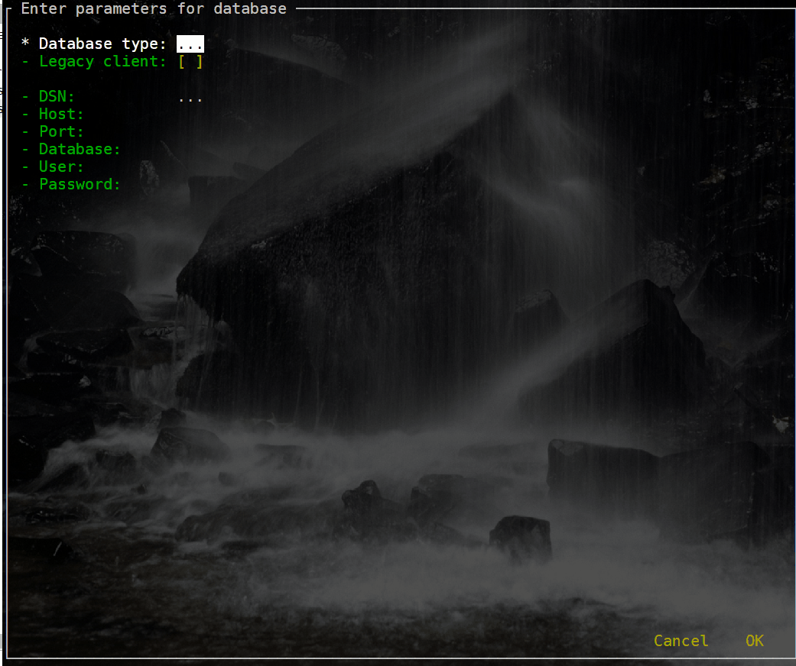
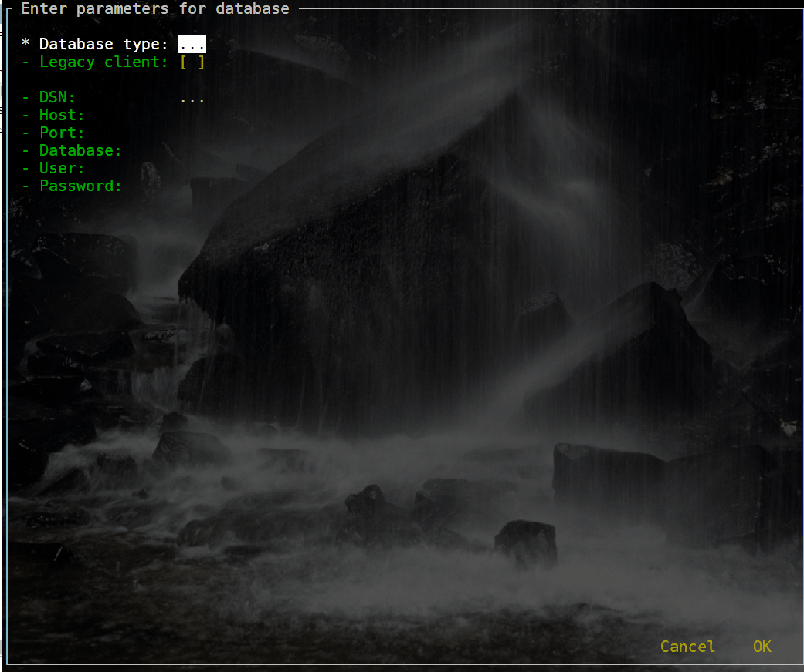
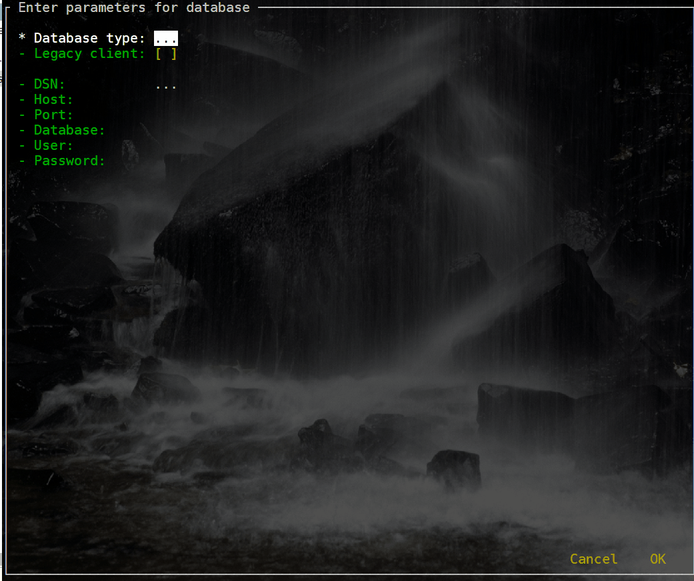

= README
:toc:
:toclevels: 1
:sectnums:
:note-caption: :information_source:

== Introduction
Modern SQL shells like `mssql-cli`, `mycli`, `SQLcl` or `pgcli` are very convenient: they offer auto-completion, syntax highlighting, query history, a multi-line editor, and much more.

`SQL Shell` makes using your favorite SQL client even more convenient:

* a standard interface to enter connection parameters so you don't have to remember command line options and syntax
* defaults for host name, port, and user to save you time

Additional features:

* DSNs (pre-defined connection strings) for connections without typing
* automatic tunneling if your database is not accessible from the outside (behind a firewall or listening only on localhost interface)
* legacy client support

== Requirements
* Linux
** Python3
** Python modules `click` and `sshtunnel`
* SQL shells
** https://github.com/dbcli/mssql-cli[`mssql-cli`], https://www.mycli.net[`mycli`], https://www.oracle.com/database/technologies/appdev/sqlcl.html[`SQLcl`], https://www.pgcli.com[`pgcli`], https://litecli.com[`litecli`]
** (or legacy https://docs.microsoft.com/en-us/sql/tools/sqlcmd-utility[`sqlcmd`], `mysql`, `psql`, `SQLPlus`, https://sqlite.org/cli.html[`sqlite3`])

== Installation
* Windows
** copy `sql shell.exe`, `sql shell.ini`, and `tunnel.ini` to a directory of your choice
* Linux
** install required third-party Python modules via `pip` or `conda`
** copy `sql shell.py`, `tunnel.py`, `sql shell.ini`, and `tunnel.ini` to a directory of your choice
* install SQL shell clients of your choice
* modify `sql shell.ini` and optionally `tunnel.ini` to match your environment

== Usage
[NOTE]
If you can't get `SQL Shell` running or have questions, open a https://github.com/thorstenkampe/SQL-Shell/issues[ticket]

=== standard
image::screenshots/postgresql.gif[width=65%, title=enter database parameters manually]

=== DSN

=== automatic tunnel

=== legacy client

