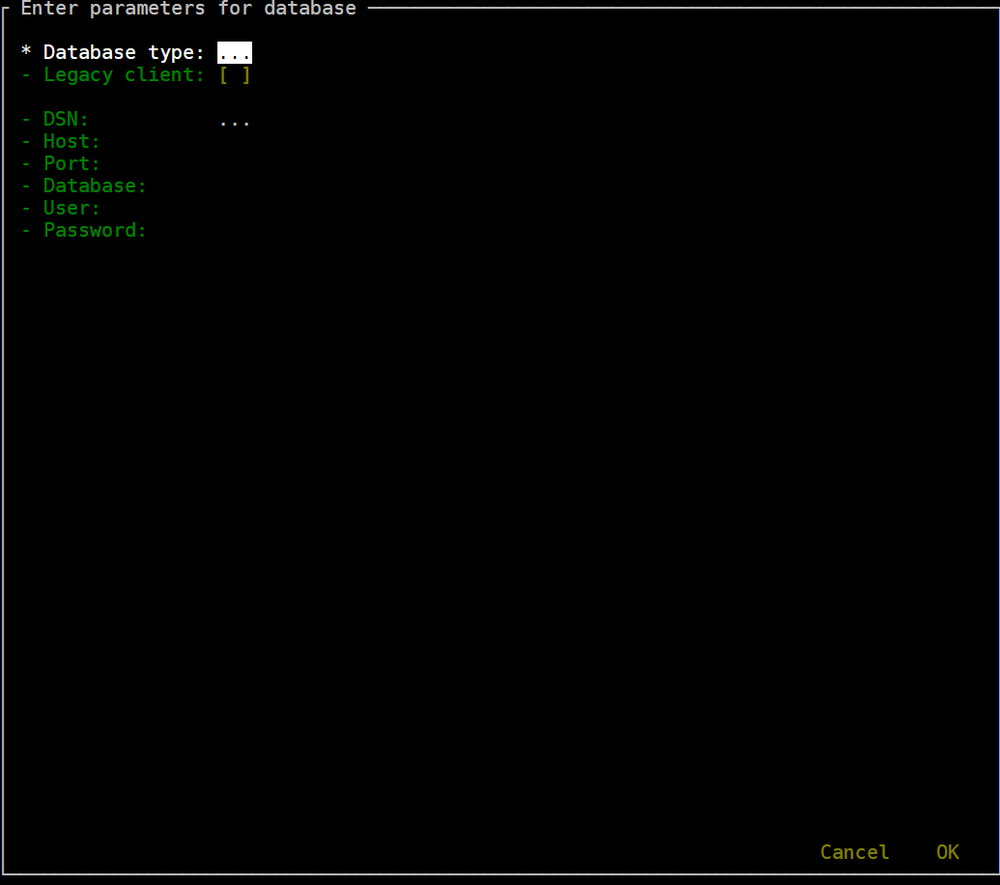

= README
:toc:
:toclevels: 1
:sectnums:
:note-caption: :information_source:

== Introduction
Modern SQL shells like `mssql-cli`, `mycli`, `SQLcl` and `pgcli` are very convenient: they offer auto-completion, syntax highlighting, query history, a multi-line editor, and much more.

`SQL Shell` makes using SQL clients even more convenient:

* a standard interface to enter connection parameters so you don't have to remember command line options
* defaults for host name, port, and user to save you time
* pre-defined connection strings for connection without typing
* automatic tunneling if your database is behind a firewall or listening only on localhost interface
* legacy client support (`sqlcmd`, `mysql`, `SQLPlus`, `psql`, `sqlite3`)

== Requirements ==
* Python modules `click`, `npyscreen`, `pycompat`, and `sshtunnel` (when using the source code files)
* SQL shell clients (https://github.com/dbcli/mssql-cli[`mssql-cli`], https://www.mycli.net[`mycli`], https://www.oracle.com/database/technologies/appdev/sqlcl.html[`SQLcl`], https://www.pgcli.com[`pgcli`], https://litecli.com[`litecli`])

== Installation
. download release (source code or Windows binary)
. optional: edit `sql shell.ini` and `tunnel.ini` to match your environment

== Usage
[NOTE]
If you can't get `SQL Shell` running or have questions, open a https://github.com/thorstenkampe/SQL-Shell/issues[ticket]

=== standard
image::screenshots/standard.png[width=65%]

=== DSN

=== tunnel

=== legacy client

