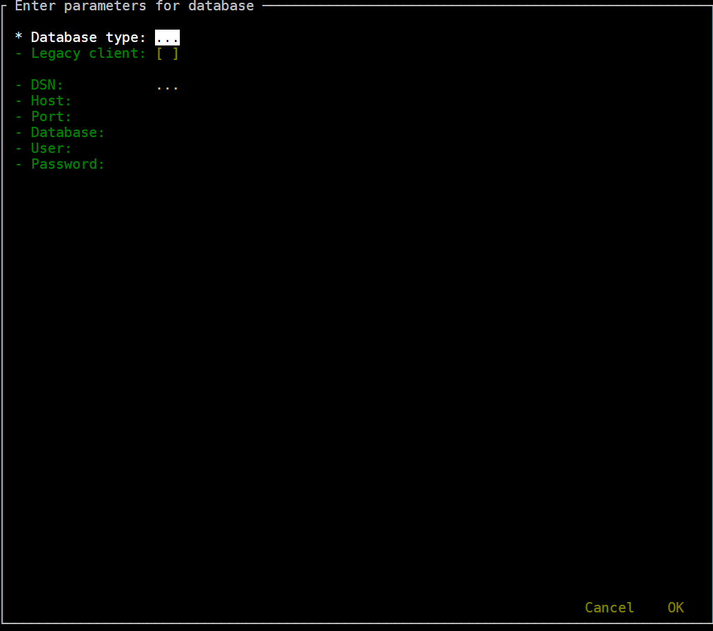

## Introduction
Modern SQL shells like `mssql-cli`, `mycli`, `SQLcl` and `pgcli` are very convenient: they offer auto-completion, syntax highlighting, query history, a multi-line editor, and much more.

`SQL Shell` makes using your favorite SQL client even more convenient:

* a standard interface to enter connection parameters so you don't have to remember command line options
* defaults for host name, port, and user to save you time
* DSNs (pre-defined connection strings) for connection without typing
* automatic tunneling if your database is behind a firewall or listening only on localhost interface
* legacy client support (`sqlcmd`, `mysql`, `SQLPlus`, `psql`, `sqlite3`)

## Installation
* Windows
  * copy `sql shell.exe` to a directory of your choice
* Linux
  * install third-party Python modules `click`, `npyscreen`, `pycompat`, and `sshtunnel`
  * copy `sql shell.py` and `tunnel.py` to a directory of your choice
* install SQL shell clients of your choice ([`mssql-cli`](https://github.com/dbcli/mssql-cli), [`mycli`](https://www.mycli.net), [`SQLcl`](https://www.oracle.com/database/technologies/appdev/sqlcl.html), [`pgcli`](https://www.pgcli.com), [`litecli`](https://litecli.com))
* optional: edit `sql shell.ini` and `tunnel.ini` to match your environment

## Usage
If you can't get `SQL Shell` running or have questions, open a [ticket](https://github.com/thorstenkampe/SQL-Shell/issues)

### standard

### DSN
image:screenshots/DSN.png[width=65%]

### tunnel
image:screenshots/tunnel.png[width=65%]

### legacy client
image:screenshots/legacy-client.png[width=65%]
